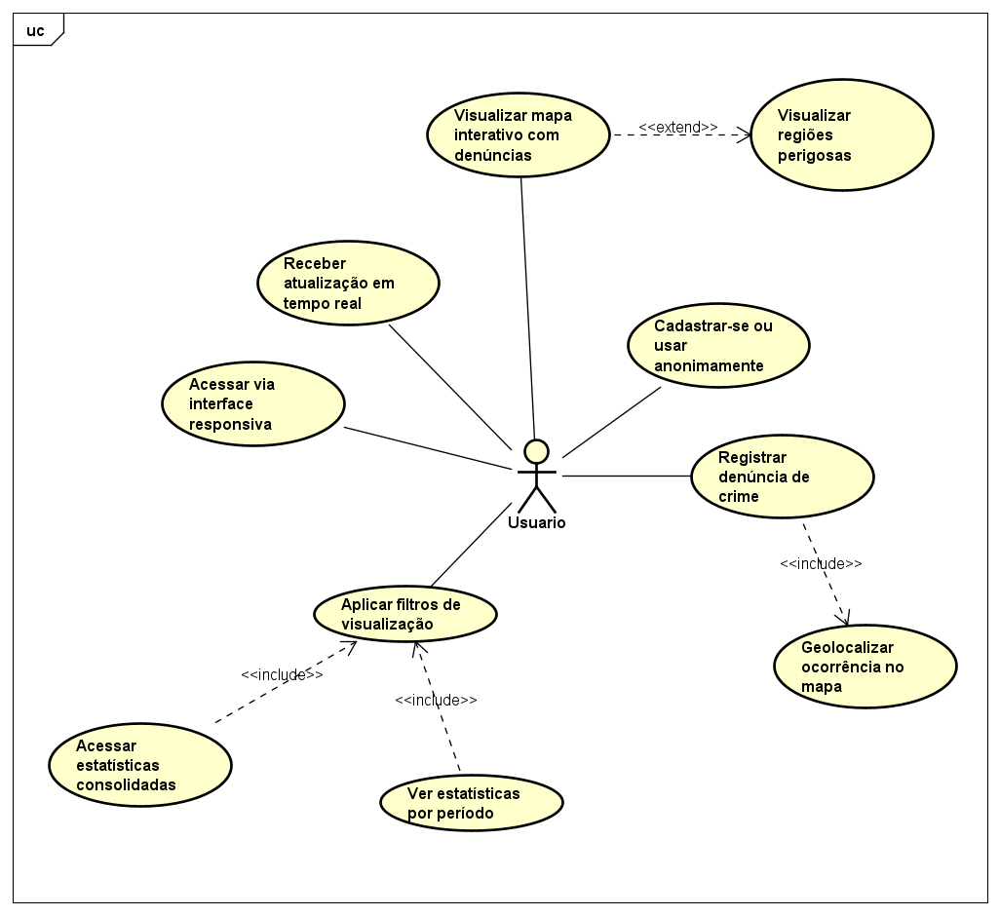

# 👁️ Olho de Hórus – Sistema de Vigilância Participativa

##  Visão Geral

Olho de Hórus é uma plataforma interativa onde cidadãos podem registrar denúncias de crimes de forma anônima e visualizar, em um mapa, as áreas com maior incidência de criminalidade. O sistema foca na prevenção, colaboração e consciência social.

##  Atores

- **Usuário Anônimo**
- **Usuário Cadastrado**
- **Administrador**

##  Casos de Uso

- Registrar denúncia
- Marcar localização da ocorrência
- Visualizar mapa com denúncias
- Aplicar filtros por tipo de crime, data e local
- Acessar estatísticas por período
- Acessar estatísticas consolidadas
- Moderação de denúncias
- Acesso ao painel administrativo

##  Diagrama de Casos de Uso

##  Documentação Técnica

Acesse a documentação completa gerada pelo Astah na pasta [documentacao-html](./documentacao-html/index.html).

---

##  Requisitos Não Funcionais

- Anonimato e proteção de dados
- Interface responsiva
- Atualização em tempo real
- Escalabilidade e disponibilidade

## Objetivos do Sistema

- Reunir e exibir denúncias de crimes feitas pela comunidade
- Informar as regiões mais perigosas
- Fornecer estatísticas e análises para conscientização e prevenção
